<picture>
  <source media="(prefers-color-scheme: dark)" srcset="./assets/dark.svg">
  <source media="(prefers-color-scheme: light)" srcset="./assets/light.svg">
  
</picture>

 

&nbsp;

&nbsp;

## About

## About

I'm an **AI Engineer and researcher** focused on designing **reliable, production-ready AI systems**. My work spans **Agentic AI, Retrieval-Augmented Generation (RAG), LLM evaluation, AI governance, and time-series forecasting**, with an emphasis on building intelligent systems that are scalable, explainable, and impactful.

I recently completed my **M.S. in Data Science, Analytics and Engineering at Arizona State University**, where my thesis explored **topology-augmented neural forecasting** for long-horizon reservoir storage prediction. I enjoy translating cutting-edge research into practical AI applications that solve real-world challenges.

## Featured Work

<table>
<tr>
<td width="50%" valign="top">

### Phoenix Climate Action Plan AI
Multi-agent policy analysis system with hybrid retrieval, structured outputs, stage-level controls, and evaluation using faithfulness and relevance metrics.

`LangChain` `DSPy` `FastAPI` `pgvector` `RAG`

</td>
<td width="50%" valign="top">

### AI-Native Task Management Platform
Agentic task platform with intent-aware CRUD, semantic deduplication, multimodal ingestion, streaming responses, RBAC, and prompt-injection guardrails.

`NestJS` `Angular` `PostgreSQL` `OpenAI` `SSE`

</td>
</tr>
<tr>
<td width="50%" valign="top">

### Topology-Augmented Forecasting
Research on integrating persistent-homology features with BiLSTM forecasting to improve reservoir-storage predictions and latent-space stability.

`PyTorch` `BiLSTM` `TDA` `Dionysus` `Time Series`

</td>
<td width="50%" valign="top">

### ARIA Industrial AI Assistant
Real-time monitoring architecture for 175 sensor streams across 90 assets, combining anomaly detection, SOP retrieval, alerts, and work-order automation.

`Kafka` `WebSockets` `RAG` `Python` `Monitoring`

</td>
</tr>
</table>

## Recognition

- **M.S. Outstanding Student**, School of Computing and Augmented Intelligence, ASU — Spring 2026
- **Most Creative Design**, ASU Hackathon — FeelIn emotion-aware dashboard
- Research and applied AI work spanning climate policy, hydrologic forecasting, industrial monitoring, and model-risk-aware AI systems

## Technical Ecosystem

## GitHub Activity

### Let us build reliable AI systems that create measurable impact.

